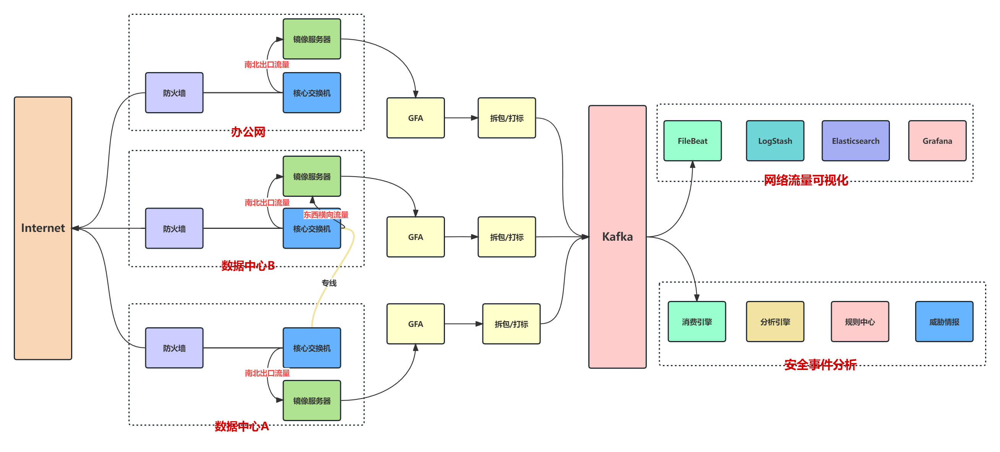

# GFA

# 介绍 (Introduction)

GFA是一个高性能、低延时的流量采集器，它具备几乎实时的拆包能力，通过多地埋点部署以及打标功能可为后续的流量可视化和安全事件分析提供支撑
GFA is a high-performance, low-latency traffic collector with near-real-time packet disassembly capability. Through
multi-site deployment and labeling functionality, it provides support for subsequent traffic visualization and security
event analysis.

# 编译 (Compile)

```bash
make build
```

# 使用 (Use)

```bash
# `core.conf.toml` as the project configuration file. Please read before usage, as detailed comments have been added.

yum install epel-release
yum install tcpdump
yum install supervisor
yum install dos2unix
systemctl enable supervisord
systemctl start supervisord
chmod +x run.sh
dos2unix run.sh

./run.sh start
./run.sh stop
./run.sh restart
```

# 流量提取 (Traffic extraction)

```bash
# You can extract other information as needed.
{
  "tcp_flags": "tcp三次握手标志位(SYN/ACK/FIN...)",
  "source_port": "源端口",
  "pcap": "pcap源文件",
  "location": "流量来源位置",
  "request_http_header": "http请求头(json)",
  "frame_length": "报文大小(bit)",
  "request_http_body": "http请求体",
  "dest_ip": "目标IP",
  "request_http_path": "http请求路径",
  "source_ip": "源IP",
  "timestamp": "时间戳",
  "service": "服务(mysql/ssh...)",
  "protocol": "应用层协议(TCP/UDP..)",
  "request_http_url": "http请求地址",
  "request_http_method": "http请求方式",
  "dest_port": "目标端口"
}
```

# 架构设计 (Architectural design)

